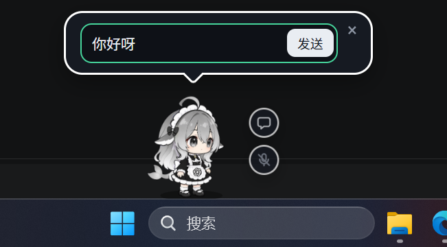
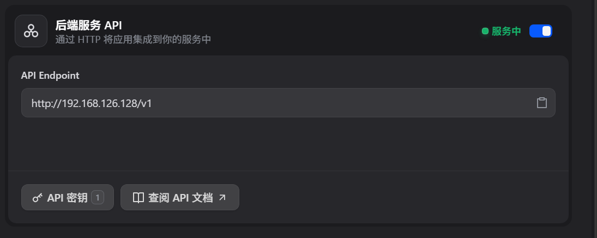

# 🐋 MyLLMTring —— 大肥鱼桌面宠物

> 全本地闭环的 AI 桌宠：Electron 桌宠 → 协议适配层 shim → Dify 智能体 → Ollama + Qwen3:8b。
> 人设（鲸鲸）配置在 Dify 里，推理全在本机。

张嘉润 · 人工智能协会创智部二面大题一实战项目。
题目要求「部署本地模型」和「搭建自己的 agent」分两问完成，本项目把它们串成了**一个能真正对话的桌宠**——
用一个协议适配层（shim）把开源桌宠接进本地智能体。

本项目部分复现了开源项目 [Pal-AI-Lab/Coopanion](https://github.com/Pal-AI-Lab/Coopanion)（AGPL-3.0），
使用其桌宠形象与框架。

### 演示

| 桌宠 | 回答 |
| --- | --- |
|  |  |

---

## 一、架构

```
┌────────────────────────────────────────────────────────────┐
│  桌宠 Coopanion（Electron / Cortico 框架）│
│  控制台 http://127.0.0.1:17788                             │
│  ⚠️ 必须激活本地 provider「qwen3-8b」，否则走云端不经过 shim │
└───────────────┬────────────────────────────────────────────┘
                │ POST /responses（OpenAI Responses，严格 SSE）
                ▼
┌────────────────────────────────────────────────────────────┐
│  shim 协议适配层   127.0.0.1:8787   （本项目自研，零依赖）   │
│  把 Dify 的文本答案合成为 pet_say 的 function_call          │
└───────────────┬────────────────────────────────────────────┘
                │ POST /v1/chat-messages（Dify Chat Messages）
                ▼
┌────────────────────────────────────────────────────────────┐
│  Dify 智能体   VMware Ubuntu 虚拟机  192.168.126.128       │
│  ★ 人设（鲸鲸）配置在这里 —— 见 persona.md│
│  向量库：pgvector                                            │
└───────────────┬────────────────────────────────────────────┘
                │ Ollama provider
                ▼
┌────────────────────────────────────────────────────────────┐
│  Ollama + Qwen3:8b   Windows 宿主机  127.0.0.1:11434      │
└────────────────────────────────────────────────────────────┘
```

### 为什么需要 shim

两边协议不兼容，而且**桌宠看不见纯文本**：

| | 桌宠（Cortico） | Dify |
| --- | --- | --- |
| 端点 | `POST /responses` | `POST /v1/chat-messages` |
| 说话方式 | 只能通过 `pet_say` / `pet_ask` **工具调用** | 返回纯文本 `answer` |

桌宠世界只把工具调用渲染成头顶气泡，**模型直接回文本用户永远看不到**。
所以 shim 把 Dify 的答案包成 `pet_say` 的 function_call，再吐成严格的 SSE 序列。

→ 细节见 [`shim/README.md`](shim/README.md)

### 人设在哪

**不在代码里，在 Dify 控制台里。** [`persona.md`](persona.md) 是人格的唯一事实来源
（鲸鱼娘、句尾口癖「鲸鲸」、禁止输出思考过程），改它只需改文件再同步到 Dify 应用。


---

## 二、跑起来

### 前置条件（三件事，脚本不会帮你做）

| 前置 | 说明 |
| --- | --- |
| **Ollama 已在运行** | 它**没有注册成系统服务**，必须手动起：`ollama serve` 或点系统托盘图标。验证：`curl http://127.0.0.1:11434/api/tags` |
| **VMware Ubuntu VM 已启动** | Dify 跑在 VM 里。VM 一开，Docker 和 15 个容器会靠 restart policy `always` 自启，**不需要进 VM 操作** |
| **`DIFY_KEY` 已配置** | Dify 应用 API 密钥（控制台 → 应用 → API 访问 → API 密钥）。**推荐填 [`shim/.env`](shim/.env)**（已被 git 忽略，不入库）：<br>`DIFY_KEY=app-xxxxxxxx`<br>也可用系统环境变量 `DIFY_KEY`（优先级更高），但 `setx` 要重开终端才生效，所以双击 bat 启动请用 `.env`。**不配会用兜底假 key 然后静默 401** |

```bat
rem 方式一（推荐）：写进 shim/.env，不用重开终端
notepad D:\aiu\MyLLMTring\shim\.env

rem 方式二：系统环境变量，优先级更高，但 setx 必须重开终端才生效
setx DIFY_KEY app-xxxxxxxx
```

验证 VM 里 Dify 是否就绪：浏览器能打开 <http://192.168.126.128> 就说明容器起来了。

### 启动

1. 起 Ollama（`ollama serve` 或托盘图标）
2. 起 VMware Ubuntu VM，等 1-2 分钟让 Dify 自启
3. 配好 `DIFY_KEY`（写进 `shim/.env` 最省事）
4. 双击 **`start-pet.bat`**

脚本会依次体检 密钥 → Ollama → Dify → shim → 桌宠控制台，
缺 key 会在第一步就拦下并告诉你怎么配（不再静默 401），
并在控制台起来后**自动把模型供应商切到本地 `qwen3-8b`**，然后启动桌宠。
**保持窗口打开**，关掉即停止桌宠。

→ 每个步骤的检查目标与失败处理见 [`docs/startup.md`](docs/startup.md)

### 手动启动（不用脚本）

```bat
node shim\index.js                          :: shim（127.0.0.1:8787）
cd coopanion && pnpm dev                    :: 桌宠（控制台 127.0.0.1:17788）
```

控制台里把 provider 的 Base URL 指向 `http://127.0.0.1:8787`，模型名 `qwen3:8b`。

> **改过 shim 的代码后必须重启 shim**。`start-pet.bat` 见到 8787 已监听会直接复用旧进程——
> 这个坑今天踩过一次，脚本显示一切正常，但跑的是改动前的版本。

### 不想开桌宠，只想验证链路

```bat
python src\chat.py --provider ollama   :: 只测模型层
python src\chat.py --provider dify     :: 测智能体层（Dify + 人设）
```

用它在几秒内二分出「是模型坏了还是智能体坏了」。→ [`src/README.md`](src/README.md)

### 环境要求

- **仓库路径必须全 ASCII**。放在中文路径下会让 Node 的 `cpSync` 崩在 `0xC0000409`。
  仓库当前位于 `D:\aiu\MyLLMTring`
- Node >= 18（shim 零第三方依赖）、pnpm（桌宠工程）、Python 3（仅调试 CLI）

### 接入 VM（需要排查容器时）

```bat
ssh -i C:\Users\28687\.ssh\ubuntu_vm lesm1128@192.168.126.128
sudo docker ps        # 应有 15 个容器
```

---

## 三、今天修掉的三个 bug

都是「桌宠不出气泡」这一个症状，根因各不相同：

| # | 现象 | 根因 |
| --- | --- | --- |
| 1 | shim 返回纯文本，没有 function_call | **跑的是旧代码进程**。改完代码没重启，测的是改动前的版本 |
| 2 | 模型不调本地工具 | 控制台激活的是**云端 provider `ds`**，本地的 `qwen3-8b` 没被选中 |
| 3 | **流被判 aborted，工具永不执行** | **核心 bug**，见下 |

### 核心那条铁律

`response.output_item.added` 事件的 `arguments` 字段**必须是真空串 `''`**。

原来的代码发出的是 `'{"script":""}'`。但 `arguments` 是**增量累加型**字段，
上游 Cortico 框架会把 delta 累加到起始值上，再与 `output_item.done` 的干净值比对：

```
'{"script":""}'  +  '{"script":"你好"}'  =  '{"script":""}{"script":"你好"}'
                                              ≠  '{"script":"你好"}'
```

校验失败（`Final function arguments disagree with deltas`），
**整条流被判 aborted，工具永不执行**。而且服务端日志里看不到任何报错。

> **教训：增量累加型字段的起始值必须是「该类型的空值」，
> 不能是「空内容的序列化结果」。** 空串和 `{"a":""}` 语义完全不同。

同时摸清了 Cortico 的 input 结构——**用户打的字不在 user message 里**，
而是在 `external_event_frame` 的 `function_call_output` 里
（形如 `[2 new events] … [打字] les:你是谁？`）；
user message 只有一句「`[system] 2 条新事件。`」，且每轮发的是**全量上下文**。

→ 完整复盘见 [`docs/bubble-fix-handoff.md`](docs/bubble-fix-handoff.md)

---

## 四、文档

| 文档 | 解决什么问题 |
| --- | --- |
| [`shim/README.md`](shim/README.md) | **最重要**。端点契约、SSE 六事件序列、`arguments` 铁律、Cortico input 结构、配置项、`DEBUG=1` 调试、故障排查表 |
| [`docs/startup.md`](docs/startup.md) | `start-pet.bat` 六个步骤各自检查什么、失败了怎么办 |
| [`src/README.md`](src/README.md) | 联调 CLI 的两种模式、用法，以及它和 shim 的重复实现问题 |
| [`docs/README.md`](docs/README.md) | 全部文档索引：开发日志怎么读、各文档什么时候看 |
| [`docs/REVIEW.md`](docs/REVIEW.md) | 代码审查报告：工程现状、已知技术债、「如果只做三件事」 |
| [`persona.md`](persona.md) | 桌宠人格（鲸鲸）的唯一事实来源 |
| `docs/log/day1~3/` | 开发日志：本地模型部署 → Dify 智能体搭建 → 全链路打通 |

### Dify 相关截图




---

## 五、哪些是自研的

`coopanion/` 是复现的开源项目，桌宠形态、核心框架、`vendor/cortico` 都是上游的。

**真正需要长期自己维护的只有三处**：

| 位置 | 说明 |
| --- | --- |
| [`shim/`](shim/) | 协议适配层，本项目的核心。零第三方依赖，Node >= 18 直接跑 |
| `start-pet.bat` | 一键启动与前置探测 |
| 文档 | 根 README / `shim/README.md` / `docs/` |

技术选型上，**用 HTTP 协议把桌宠与大脑解耦**，而不是把逻辑塞进 Electron 主进程——
这个决定让整个方案在可控范围内跑通了。

### 一点说明

最初把「部署本地模型」和「搭建 agent」误当成连在一起的一问，
部署完 Qwen 后才发现扣子用的是云端 API，于是改成用 shim 把两者串起来——架构因此比必要的大一些。
但也因此得到一个可复现的**全本地闭环**：模型和人设都在本机，不依赖任何云服务。

每轮对话要等几秒，是本地 8B 模型推理的正常速度。
