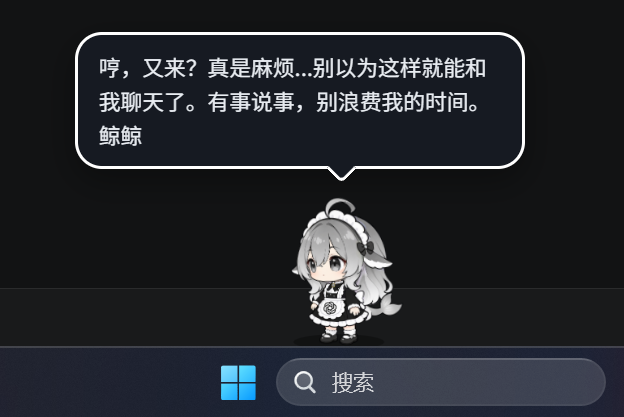
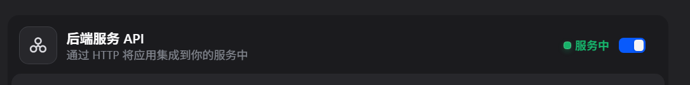
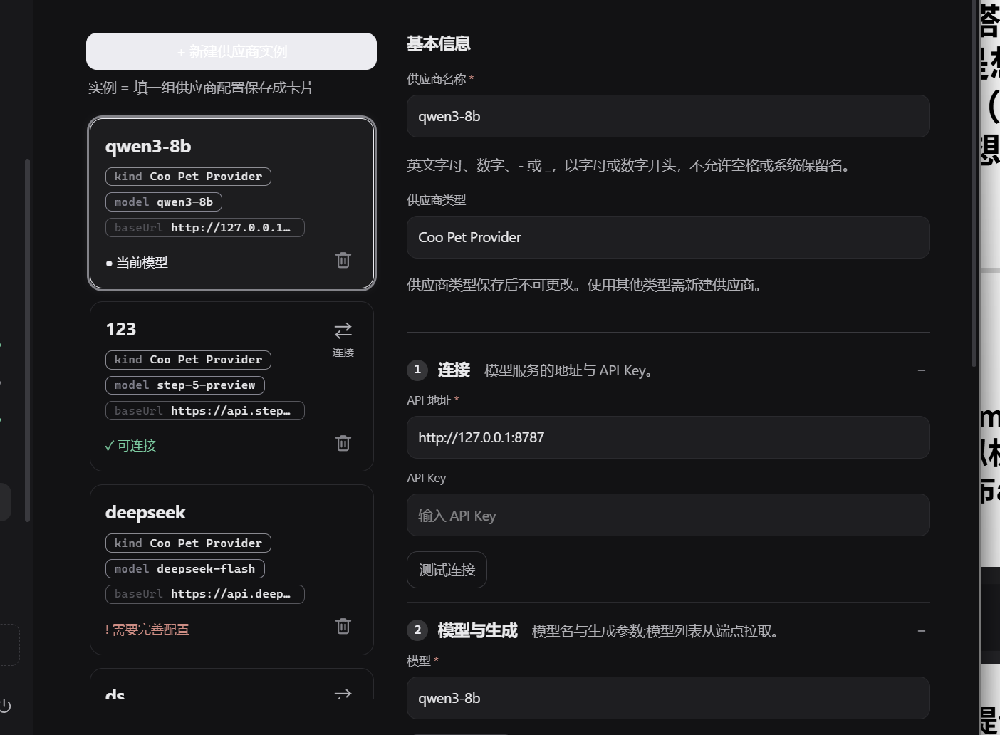

# 🐋 MyLLMTring

### 张嘉润 · 人工智能协会创智部二面大题一实战项目：大肥鱼桌面宠物

  *技术路线：本地qwen模型 ——> ollama（小题1） ——> dify（小题2，我觉得这也算一个agent，毕竟人格设置是在这里完成的） ——> shim（用于开源桌宠和本地模型之间的协议交换） ——> 开源桌宠*

  本项目部分复现了此开源项目，我只是单纯想要这个大肥鱼形象（https://github.com/Pal-AI-Lab/Coopanion）
###    演示
  
  

  ## 心路历程：我一开始看错题目了，我以为一二小题是连在一起的，然后我部署完qwen之后下载了扣子，发现搭agent是用的云端api，然后又回去看了看题目，发现部署本地模型和搭建自己的agent大概是要分开搞的，但我还是想要一起做了，所以就想了这个极其绕的方式（所以就导致了这个项目你大概只能看看，但是想要复现有点麻烦）
-----------------------------------------------------------------------
  ## 技术细节 ：
  ### 先通过 ollama 部署/运行本地模型，然后以ollama为供应商，提供给dify（dify本体其实跑在Linux虚拟机，但是web可以在windows打开），之后在dify上面发布agent拿到api(就是下面这个)
  
## dify里面记录了桌宠的人设，之后把dify提供的api提供给桌宠软件

## 再经过ai写的一个叫shim的协议适配层然后就形成闭环啦！虽然每次对话要花好几秒响应。
-----------------------------------------------------------------------

### 启动流程：1，打开Linux虚拟机，待dify自启动
### 2，点击start-pet.bat，启动桌宠（好像是一个被称为electron的桌面应用），然后就可以愉快（？）地对话了
-----------------------------------------------------------------------
*后记：说实话，整个项目前面部分大部分还是我自己负责的，但是后面的修bug和写shim协议我是一点也看不懂，总之这个项目还是跑起来了*

