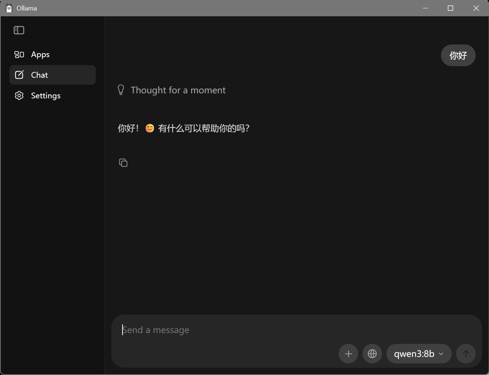

# 这是我的项目启动的第一天
我让AI给我搭了个骨架，当然这一篇工程日志本来也是他写的，
但奈何我觉得他写的有点屎（指可能与之后的工程日志连在一起会很乱），
###### 所以我还是尝试自己写吧（我自己写的也很屎啦）

### 1、搭建了我心目中项目的骨架
### 2、学习了一下md文件的书写（其实只学了一点点.）
### 3、部署了本地模型，通过ollama（qwen3-8b）
### 4、在ollama里面和我的本地模型说你好，成功了！
*附件*

嘻嘻
***本文件创建于10/1 但是完成于10/2  1：24***